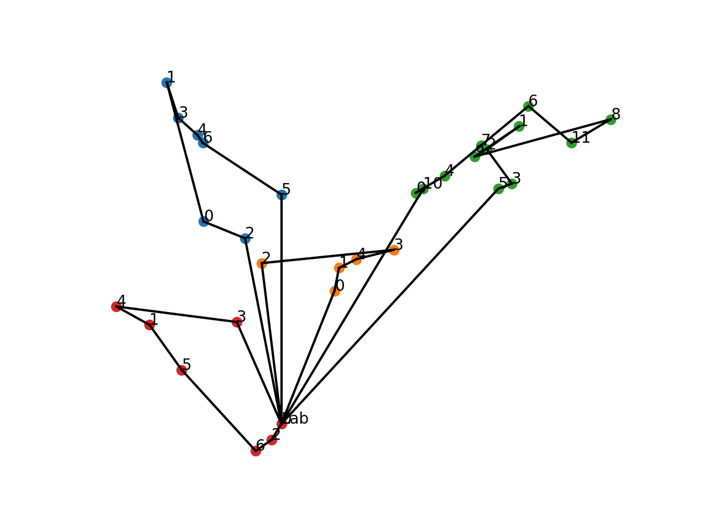

# CAU Project · Route Optimization

A university project from my early days learning Python in 2018, exploring the **multiple traveling salesman problem**: dividing visits to doctors among drivers returning to a shared laboratory.

The approach projects travel times into 2D, groups stops with custom clustering, and improves routes using 2-opt and simulated annealing while checking a travel-time limit per driver.

*An original route visualization from the project.*

Start with [solver.py](solver.py); [Clustering.py](Clustering.py) and [Opt2.py](Opt2.py) contain the algorithms. Sample inputs are in [Testinstanzen](Testinstanzen/).

Preserved as a learning snapshot, with the original Python 3.6-era code unchanged.
